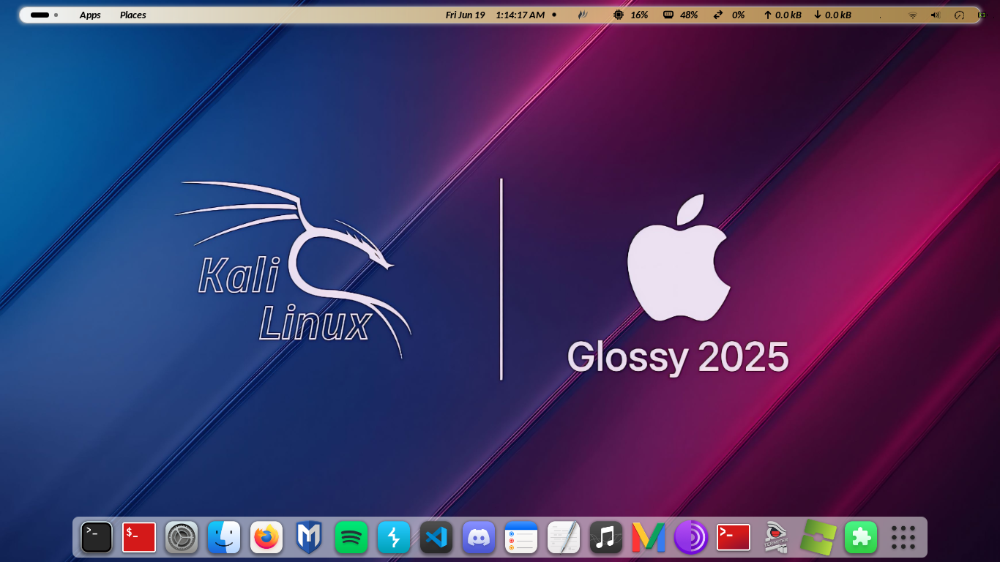

# KalMacScript Gnome macOS 🍏

_preview_



**_KalMacScript_** adalah alat otomatisasi ringan (_lightweight_) yang dirancang khusus untuk melakukan **Backup**, **Restore**, **Simulasi (Dry Run)**, dan **Rollback** seluruh kustomisasi tampilan macOS pada **Kali Linux GNOME (Wayland/X11)**.

Script ini secara mendalam mencakup konfigurasi sistem, tema GTK, ikon, font, ekstensi GNOME Shell, wallpaper aktif, hingga animasi _booting_ (Plymouth).

> **CATATAN TENTANG PLYMOUTH:**  
> Sebelum script mengeksekusi perintah penyalinan file tema boot dan pembaruan sistem bootloader (`initramfs`), sistem akan bertanya kepada pengguna apakah Plymouth ikut di-restore sekalian atau akan dilewatkan sepenuhnya tanpa merubah tampilan Plymouth bawaan.

---

## 🌟 Fitur Utama

- 🎨 **Deep Backup & Restore**: Menyimpan dan mengembalikan seluruh tema GTK-3/GTK-4, `.themes`, `.icons`, dan font sistem.
- ⚙️ **Dconf/GSettings Registry**: Mengatur ulang tata letak dock, shortcut, dan preferensi tampilan GNOME secara presisi.
- 🧹 **Privacy Sanitizer**: Otomatis membersihkan data pribadi sensitif (email, recent files, online accounts) pada file dconf sebelum disimpan.
- 🛠️ **Auto-Install Dependensi**: Mendeteksi paket sistem yang belum terpasang (`dconf-cli`, `libglib2.0-bin`, `plymouth`) dan menawarkan instalasi otomatis.
- 🧪 **Mode Simulasi (Dry Run)**: Mengecek integritas file arsip backup dan file konfigurasi tanpa mengubah atau menulis file pada sistem.
- 🛡️ **Safety Rollback Snapshot**: Otomatis membuat titik cadangan (_snapshot_) sebelum restore, sehingga tampilan dapat dikembalikan jika terjadi pembatalan.
- ⚓ **Dash to Dock Auto-Fix**: Mengatur posisi dan animasi dock secara otomatis agar langsung presisi bergaya macOS.
- 🧩 **Extension Manager**: Mengamankan seluruh ekstensi GNOME Shell (User & System-wide) lengkap dengan kompilasi skema otomatis agar bebas dari bug/crash.
- 🖼️ **Auto Wallpaper Fix**: Otomatis memulihkan wallpaper dan memperbarui _path_ ke direktori pengguna baru.
- 🐉 **Plymouth Boot Theme**: Mengamankan animasi _booting_ macOS dan melakukan _rebuild_ `initramfs` otomatis saat restore.
- 🔀 **Hybrid Compatibility**: Mendukung deteksi arsip terkompresi (`.tar.gz`) maupun folder aset mentah.

---

## 🚀 Cara Penggunaan

Script ini akan mendeteksi dan menawarkan instalasi otomatis jika ada dependensi sistem yang belum terpasang.

### 1. Cloning Repositori

Buka terminal dan jalankan perintah berikut:

```bash
git clone [https://github.com/Marz57/kali-x-macos](https://github.com/Marz57/kali-x-macos)
cd kali-x-macos
chmod +x gaskeun.sh

2. Menjalankan Script
Jalankan script menggunakan perintah:
./gaskeun.sh

Nanti akan muncul menu interaktif:
 * Pilih 1 untuk melakukan Backup seluruh tampilan macOS kamu saat ini.
 * Pilih 2 untuk melakukan Restore tampilan pada sistem Kali Linux yang baru.
 * Pilih 3 untuk menjalankan Dry Run (Simulation Mode) guna mengecek integritas backup tanpa merusak sistem.
 * Pilih 4 untuk melakukan Undo Restore (Revert) jika ingin mengembalikan tampilan ke keadaan sebelum restore.
 * Pilih 5 untuk mengganti variasi tampilan Banner ASCII.
 * Pilih 6 untuk Keluar.
> Catatan Penting setelah Restore:
> Setelah proses restore selesai, wajib melakukan Reboot / Log Out agar GNOME Shell memuat ulang seluruh tema, CSS, dan ekstensi baru.
> 
📁 Struktur Direktori Backup
Secara otomatis script akan membuat direktori ~/Kali_macOS_Backup dengan struktur sebagai berikut:
Kali_macOS_Backup/
├── kali_macos_theme.tar.gz   # Arsip kompresi seluruh tema, ikon, font & ekstensi
├── gnome_settings.dconf      # Registry konfigurasi GNOME Shell (sanitized)
├── wallpapers/               # Salinan wallpaper aktif
├── plymouth_backup/          # File tema booting Plymouth
├── system_extensions/        # Ekstensi tingkat sistem (/usr/share)
└── raw_assets/               # Folder mentahan aset UI

👥 Kredit & Informasi
 * Coded by : OfficialMarz57
 * TikTok : M a r z 5 7
 * GitHub : OfficialMarz57
 * Instagram : M ? r z 5 7
 * Special Thanks : DevlinTeamSec
> Terima kasih telah menggunakan script kami. Jika menemukan kendala atau bug, silakan hubungi kami via DM TikTok maupun Instagram dengan link diatas.
> 

